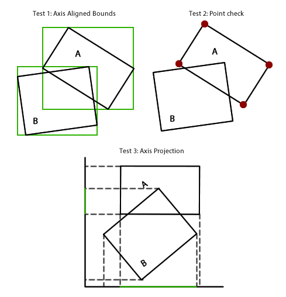
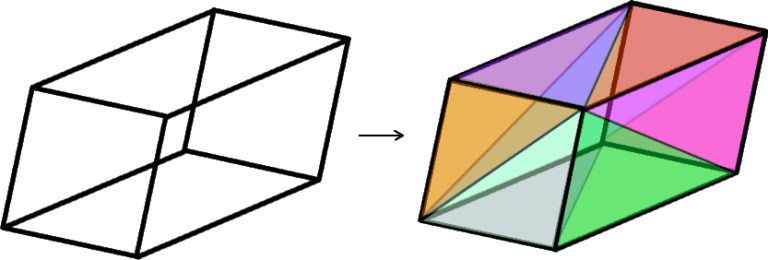

2017-12-07 #unity #programming

Have you ever had two arbitrarily rotated and sized rectangular prisms, and wanted to check if they’re intersecting? I know I have! Just an old AABB won’t do the trick, as very snug fitting rectangular prisms need to be detected and dismissed. There are some dastardly configurations (for instance, imagine a very very small rectangular prism sitting just above the surface of a massive and highly skewed rectangular prism) which also need to be sussed out.

It turned out to be a surprisingly tricky problem, and I had to pull a lot of different things from a lot different places together to get it working.

So how does it work? Well first lets think about the problem in 2 dimensions. There’s 3 escalating tests we can run to check if these rotated boxes overlap. The first is to generate two axis-aligned boxes and run a quick AABB check as a broad phase check. The second is to iterate the points of one of the boxes and check the overlap. If there are any points within the box, the box is overlapping. If that is inconclusive, we run the final and most expensive test. First, we pick one of the boxes to define a set of axis in whatever dimensions we’re working with. We basically rotate the whole world in such a way that one box is now perfectly aligned with the axis. Then, we project to each axis. If any of the projections do not overlap, we can guarantee that the boxes do not overlap either.

It’s pretty much a straight shoot up into the third dimension for the first 2 tests. However, for the 3rd, instead of projecting a 1D line from a 2D shape as above, we instead project a 2D shape onto a 2D surface. To do this, we decompose the rotated 3D rectangular prism into its composite triangles.

We can then flatten these triangles against a 2D axis by swizzling their coordinates. We then can do the much simpler test of if a triangle is intersecting an axis aligned rectangle, for each triangle. If any of the triangles succeed, the whole axis succeeds and exits. If all axis succeed, the test is a success and the rectangular prisms absolutely do overlap.

As always let me know if you think I’ve done it wrong, or if there was a simpler way to do this, or if you think I fucked up somewhere.

Get it [here.](https://github.com/cowtrix/UnityRectangularPrismOverlap)