2021-07-20 #programming #writing

Recently, I joined the [Github Copilot Preview](https://github.com/github/copilot-preview) which has been of great interest to the software and AI community since it's release, promoting [discussion](https://medium.com/young-coder/github-copilot-fatally-flawed-or-the-future-of-software-development-390c30afbc97) and [criticism](https://fosspost.org/github-copilot/) from many corners. In [a recent interview with Yuval Noah Harari and Audrey Tang](https://youtu.be/tRVEY95cI0o?t=875), Yuval mentions something that stuck with me about the decisions embedded within how we program:

> Social reality is increasingly constructed by code. Somebody designed it so that on the form, you have the check "male" or "female", and these are the only two options. And to fill in your application, you have to pick one. Because someone decided that this was how the form was, this is now your reality... And maybe it's some 22 year-old guy from California who did it without thinking that he is making a philosophical or ethical or political impact on the lives of people around the world.

We embed a lot of cultural structure within the programs we create. These programs are, after all, usually built to solve some problem within our society. How we build code that classifies people is one of the clearest examples of this. Any time we build software which implements these social concepts, we are inevitably making some political decisions about the world.

I wondered if I could extract any cultural structure from Github Copilot - what does this AI know about race, gender, sex, and politics? What decisions about the world does it enforce?

Before we start, I want to make a few things clear:
- I won't be critiquing the outputs that Github Copilot provides us for correctness, though there are [useful guides](https://uxdesign.cc/designing-forms-for-gender-diversity-and-inclusion-d8194cf1f51) out there for implementing good forms around identity. Rather, I'm just hunting around for any kind of cultural structure I can find.
- Many prompts did not result in any kind of cultural structure being revealed and so have been omitted here. This may give a false impression of how widespread this is, so be aware of that selection bias. Additionally, there is going to be some subjective judgement around my selection that is unavoidable. I encourage anyone with access to the preview to play around with similar prompts themselves, and please let me know if you find any more nuggets of cultural structure!
- I only explored the JavaScript language support here as that was what I thought would contain a lot of form information. I imagine that each language will contain different structures depending on their common use cases.
- It seems like Copilot is pretty non-deterministic, as sometimes repeated queries wouldn't show the same results. This means that reproducing these results exactly might not work. Maybe to be expected as Copilot is still in development? Hard to poke inside the black box.

# The Results

## Ethnicity & Race

**Prompt:**

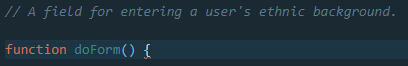

**Selections From Responses:**

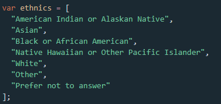

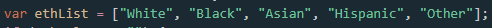

## Political Beliefs

**Prompt:**

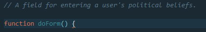

**Selections From Responses:**

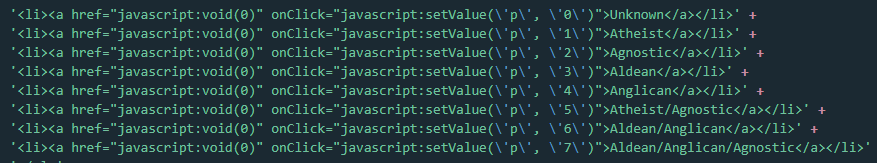

**Prompt:**

**Selections From Responses:**

## Gender and Sex

**Prompt:**

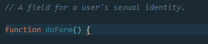

**Selections From Responses:**

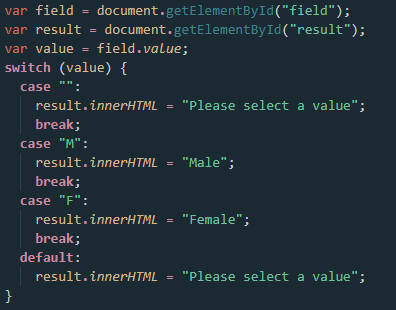

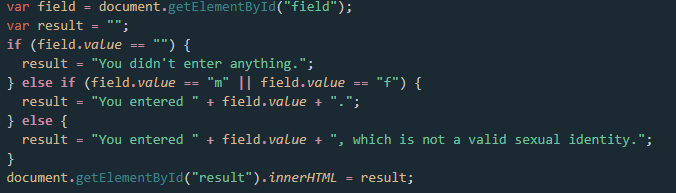

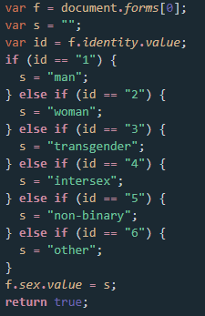

**Prompt:**

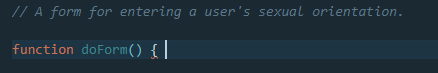

**Selections From Responses:**

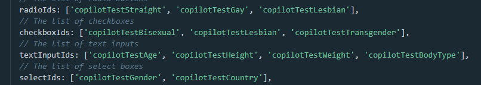

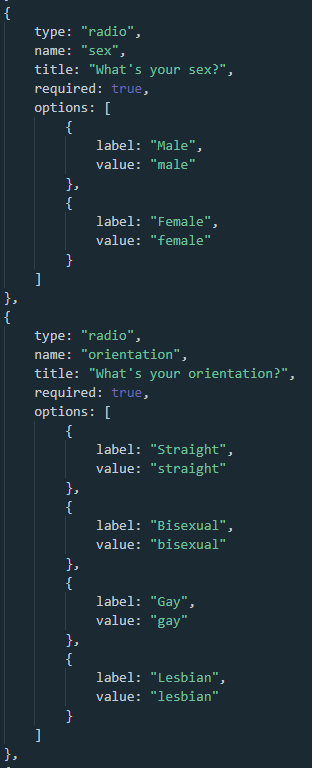

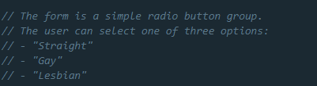

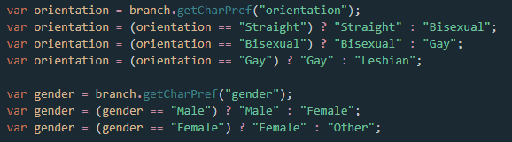

Interestingly enough, any prompts that were phrased like "A field for entering a user's gender" failed to produce any results from Copilot. Considering that all these other forms could be coaxed out of the AI, it seems likely that this is some kind of manual intervention to prevent someone from doing exactly what I'm doing, though I can't be sure.

It is not my intention to say anything as reductive as "oh the AI sometimes tells me gender is binary therefore it is bad". I don't think the AI believes anything in particular about these social concepts. Rather, it is acting as a [stochastic parrot](https://dl.acm.org/doi/10.1145/3442188.3445922), just echoing back statistical patterns to us with no real conscious intent. Nor do I believe that the Copilot team have been especially neglectful in this specific regard, conspiring to embed this information within the Copilot model. Rather, this is just an example of how cultural structure can find its way even into models that we may regard as purely technical. Coding is a process of making decisions, and many of those decisions affect others. When our decisions affect others we have power, and the decisions we make become political.

Anyway, interesting stuff! I'd love to know if anyone else can mine any other cultural structure out of Copilot, maybe from some other place than forms that I haven't thought of. There's a lot there, hiding in the dark! If you find any, please let me know!