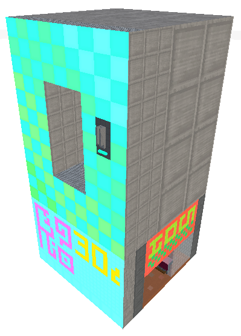

2021-06-07 #programming #gamedev #unity

Introducing voxul, a voxel system and editor tool for [Unity 3D.](https://unity.com/) Use it to build voxel meshes, objects and levels. 

The best way to demonstrate this tool is through showing its use. Unfortunately, I'm a much worse voxel artist than I am a tools programmer, and so the demonstration is but a shadow of its potential in my hands. I'd love to get it in the hands of someone a little more artistically talented and get some feedback. This is open source, and there is still plenty of optimization, polish and work to be done.

<video controls><source src="img/voxul/bonsai.mp4" type="video/mp4">Sorry, your browser doesn't support mp4.</video>

# Where can I get it?

Download voxul [here.](https://github.com/cowtrix/voxul)

# Requirements

- Unity 2020.3.2f1 or later
    - Your project must include both the [Universal Render Pipeline](https://docs.unity3d.com/Packages/com.unity.render-pipelines.universal@11.0/manual/index.html) & [Shadergraph](https://unity.com/shader-graph)
	
# Installation

Either clone the Github repository above into your `/Assets/` folder of your Unity project, or use the Unity Package Manager to clone the above repository.

# Features

- Advanced voxel mesh editor: add, remove, subdivide, select, copy/paste, mirror

- Supports transparency and emission
- Subdivision and resolution layering system that lets you mix and match different voxel grid resolutions.

- Automatic spritesheets and custom texturing for each voxel face.
- Paint surfaces seperately, controlling colour and texture

- Lots of useful utilities for building your voxel systems, like destroyable objects.
- Edit in-scene mesh objects, or save your meshes to their own `VoxelMesh` assets.
- Works efficiently and shares meshes with prefabs and multi-instanced objects.

# Gallery

<video controls><source src="img/voxul/wurmfight_01.webm" type="video/webm">Sorry, your browser doesn't support webm.</video>

*A destroyable voxel prototype I made.*

