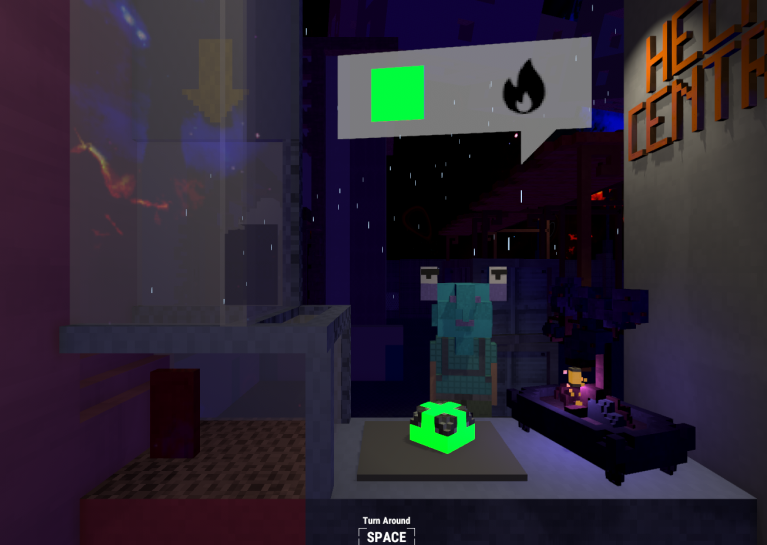
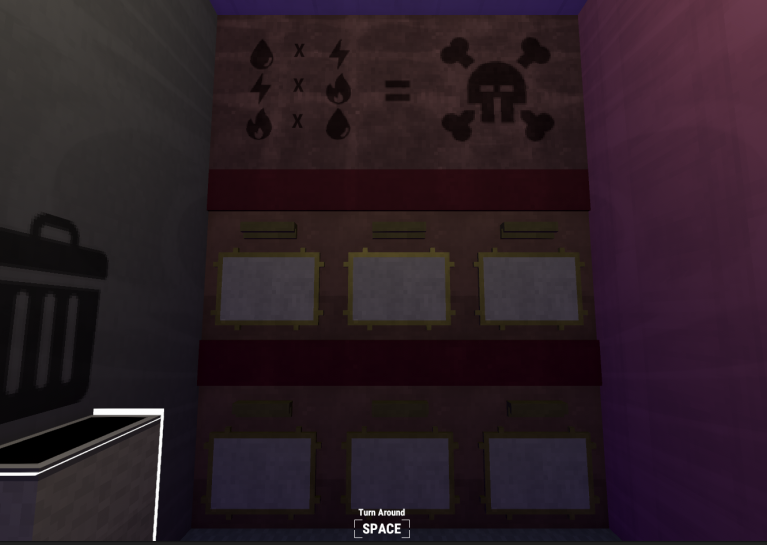

2021-01-31 #unity #programming #creative

This is my entry for the Global Game Jam 2021! I did it all myself with public-source assets for things like audio and textures, combined with a little voxel engine I've been building.

## [Play it here.](../static/2021/InterdimensionalHelpCentre.zip) 

Just download the .zip file, extract is somewhere, and run the executable file.

#### [Gamejam Entry Page](https://globalgamejam.org/2021/games/charlie-bones-interdimensional-help-centre-1)

> Handling the lost and found box for an interdimensional plane is a thankless job - which is good, because we didn't have time to implement being thanked. But it is also one that requires careful organisation and quick customer service. Things are found all the time on the interdimensional plane, and they don't all get along. But when someone comes looking, Charlie Bones will find the missing item.

Apologies for the framerate in the video below.

