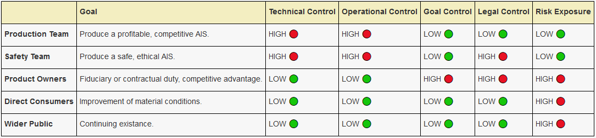

2021-05-01 #writing #ai #question

Much has been written about the dangers of artificial intelligence, and how the intelligent systems we build may sometimes unintentionally drift in alignment from their original goals. However, we seem to focus almost entirely upon an Artificial Intelligence System (AIS) drifting from an organisation's values, and little attention is paid to the danger of organisation's values drifting from alignment with the common good. It is our responsibility when judging risk to plan for bad actors, despite any desire to be optimistic about the human condition. We do not yet know if truly malevolent artificial intelligences will come to exist. We can be confident in the existence of such human beings.

This essay does not address the technical question of how you embed ethics within an artificial system, as much of the field focuses on. It instead attempts to draw attention to a more social question: how do we build organisations that are strongly incentivized to create safe and ethical intelligent systems in the first place?

# Goals, Control & Risks

Who are the groups that have a stake in the safety of developing AIS?

- **Production Team**: The developers and technical staff working directly on improving the product.
- **Safety Team**: The people working to assure the quality and safety of the product.
- **Product Owners**: The people who have ownership over the property which makes up the wider organisation.
- **Direct Consumers**: The people who use or directly interact with the product.
- **Wider Public**: Everybody currently alive.

These groups are not necessarily separated, but rather represent a categorisation based on differences in goals and differences in power. Obviously, everyone falls into the last category regardless of involvement. Some people on the Production or Safety teams may have direct equity in the product they are developing, and therefore also fall within the category of Product Owners. There are many complex interactions between each group, with each exhibiting different goals and relationships to power.

In this table, we can see the different levels of control and exposure to risk that each group of stakeholders has. The Safety Team row is highlighted in order to demonstrate its necessity in this equation, and how it fulfils a role distinct from others.

- *Technical Control*: This refers to direct development of the core technologies relating to the AIS. For instance, decisions about algorithms, datasets, technical systems and other domains which require specialized knowledge.
- *Operational Control*: This refers to the ability to halt, limit, or otherwise suppress the operation of an AIS. For instance, decisions around halting the release of a feature or update, or even decisions around taking the whole system down.
- *Legal Control*: This refers to the ability to make legally binding decisions about the operation of the AIS. For instance, control over the physical infrastructure and intellectual property which makes up the product.
- *Goal Control*: This refers to the ability to effectively set and enforce the overarching goals of the organisation. For instance, control over the constitution of the corporation, its hiring, firing and compensation processes, and high-level objectives.
- *Risk Exposure*: How much does each group risk by producing an unsafe AIS? For instance, a Production Team may be relatively insulated from a product they build which is deployed in some other country, while a Product Owner has some concrete ties to the real-world consequences of that product.

In practice, these differing goals, risks, and control will inevitably lead to situations in which the incentives of some parties do not align with others. It must be the role of any regulatory framework to ensure that when this occurs, it is the public interest which wins out.

The group **Safety Team** is the primary fiction of this essay. In our current world, this team rarely, if ever, exists as described. For many AIS the roles of Production Team and Safety Team are not only merged, but the latter is given mostly second thought. I argue not only that it is impossible for a properly incentivized Safety Team to perform well if it is merged with Production, but that the Safety Team must have some form of real, independant, legally binding ability to exert control over the AIS. If you come away with anything from this piece, burn this concept into your mind - the goals of a Safety Team are irreparably divergent from the Production Team and Product Owners.

# Core Principles

To form a robust framework for incentivising safe and ethical AIS on an organisational level, it is critical to understand the nuances of how these different goals, risks, and levels of control interact to produce material outcomes. It is only by understanding the limitations of each stakeholder - in both its ability to justly wield power and its expertise in knowing how to do so - that we may do this. It is in this spirit that I lay out these principles, in order to show the axioms from which the later recommendations emerge.

## 1. Safety is uncorrelated with Production optimization.
 
Generally, a Production Team will make decisions in order to optimise for some high-level goal. That goal might be as vague as running a profitable business, or more specific like delivering some service for as low a cost as possible.

Let us optimistically assume that every decision that the Production Team makes is a good one, in the sense that it moves them closer to this goal. Sometimes, these decisions will be ethically good. Sometimes, they won't be. There is no strong correlation between the ethical value of a decision and how it affects the microcosm of the Production Team and their movement towards goals.

## 2. The goals of a Safety Team are inherently orthogonal to a Production Team & Product Owners.

There is no reasonable set of high-level goals of the Production Team which are going to align perfectly with a dedicated, independent Safety Team. Any Production Team which fully aligns itself with a Safety team would likely find itself quickly outstripped in development speed by any other organisation with a Production team that found a more adversarial balance. A Production team must always drive down cost for the business in order to justify its existence.

A Safety team, in contrast, does not act to drive down the cost of development or even to ship a product. The lack of strong correlation laid out in the previous point means that sometimes, a solidly ethical choice will provide a lot of value to an organisation. Sometimes, however, it will act as a large cost. In this way, the goals of the Safety Team are inescapably orthogonal to both the Production Team and Product Owners.

## 3. There is no One-Size-Fits-All solution.

The challenge of building regulatory structures around any rapidly evolving technology is that it is difficult to regulate an area which is not fully understood. While there are conventions arising within AIS development, they are rapidly shifting and evolving. It is already true that many AIS affect our lives every day in a myriad of ways we may not fully comprehend. For many complex technical systems, the only people with the necessary specialized expertise to understand the system on a deep level are those directly, actively working on it.

It is for this reason that I reject the idea of an entirely detached regulatory body like with some other safety certifications. This is where an external entity comes along and does some snapshot of the state of production, and applies some set of standard tests to that information to produce some form of feedback. For instance, we understand the hazards of food safety well, and so this structure of regulation works for ensuring the quality of commercial food enterprises. Even in technologically advanced areas such as aviation, solid assumptions can be made about the physical science behind any designs or decisions. This is not true for AIS where we have very little understanding of the hazards before us or the underlying science of intelligence.

## 4. But... Every organisation needs a robust solution.

Every single organisation that is building an AIS that does any of the following requires a robust solution to AI safety:

- Consumes large amounts of compute or training data, or training data that contains information about real people.
- Applies itself to real-world decisions or actions that affect large amounts of people.
- Develops novel scaling solutions for increasing AIS intelligence or generalization.

However, it is not enough merely to mandate the existence of a safety, testing and QA process. A purely internal process is far too open to P-hacking, i.e. modifying those processes to ignore unsafe qualities when acknowledging them would be a high-cost action, which leads us to...

## 5. Organisations are incentivised to optimise out safety when it is a cost.

If it is possible for an organisation to exert control over the Safety Team to the extent where you can remove this cost - i.e. by ignoring a recommendation, firing troublesome members of the team, limiting hiring to agreeable staff, or through a myriad of other mechanisms - then that organisation will be strongly incentivized to do so. If the organisation knows that competitors are faced with the same ability to exert control, then we find ourselves within a classic Prisoner's Dilemma. Other competitors who act less ethically will optimise more efficiently, and therefore be able to outcompete any scrupulous organisation.

It is this strong incentive that makes a fully independent organisation unable to effectively self-regulate for ethics and safety, and for this reason that Safety Teams must interact with some external support framework that imbues them with legal power and legitimacy. If acting safely is a question of choice, then organisations *might* act safely, if it is in alignment with their other goals. But that is not a sufficient incentivization structure to ensure no large ethical errors. The only way to make it not solely a choice of the organisation is to distribute the power over these decisions in concrete, enforceable ways and ensure that all organisations developing these tools know that other competitors face the same restrictions.

# So what do we do?

These principles present us with a set of difficult problems, though they also unsubtly present a solution in the hypothetical Safety Team. It is likely that there are no perfect solutions to these problems, and that instead we should seek to understand the tradeoffs involved and come to democratic consensus on which to choose. But how would these teams work in practice? I present one possibility out of many below that I believe strikes a reasonable balance.

## A Model of Hybrid Independence

An effective Safety Team must simultaneously be independent from the parent organisation, and yet closely interwoven with its operations. This demands a hybrid solution - a tradeoff - between those two properties of organisational structure. This means that a robust safety process must have the following properties:

### 1. Safety Teams must have agnostic funding & finances

Allowing Safety Teams to be funded through the methods traditionally utilised in an organisation is not possible. The risk of exerting control over the Team via quid-pro-quo arrangements or denial of funds is too high. There are a few solutions to this that I can see:

- **Public Funding:** Probably a hard sell, especially as these Safety Teams become more numerous, complex, populated, and demanding of cash flow.
- **Mandated Private Funding**: Require an organisation to have a set ratio of Safety Team budget to Production Team budget. However, this places a concerning material limit on the Safety Team, and opens the possibility of regulatory capture reducing the mandated funding below a level where the Teams are effective.
- **Hybrid Private & Community Funding**: Combining mandates on private funding by the wider organisation with a mechanism for direct funding by the public enables direct community action to correct in the short-term for regulatory capture. In this scenario, it would be possible to directly donate to Safety Teams as if donating to any charitable organisation. This opens the possibility of things like requiring the wider organisation to match donations.

### 2. Safety Teams must have federalised organisation

Because of their orthogonal goals, there will inevitably sometimes be an adversarial relationship between the AI Safety community and the AIS Product Owners. These Product Owners often have vast economic and legal resources available to them and a strong incentive to exert influence over the Safety Team. If we want to be able to consistently seed teams that are protected from undue influence, those teams must be connected to a wider federalised[^1] community that can provide support, resources and collective bargaining power.

### 3. Safety Teams must have autonomy over hiring/firing

One of the primary attacks that an organisation will be incentivised to consider is the firing of Safety Team members that are creating a high level of cost, or the filtering of Safety Team hiring to build a compliant group of people unlikely to be troublesome. Considering the purpose of a Safety Team is precisely to be troublesome when that is required, this represents a deep threat to the autonomy of that team. It is therefore critical that a Safety Team control its own hiring and firing processes autonomously from the wider organisation.

### 4. Safety Teams must have access to a robust legal framework to compel action.

It is not sufficient for Safety Teams to only be able to provide guidance, advice, or research around the decisions of the organisation. While gentle guidance should of course be the default, all Safety Teams must have some way to exert concrete control over the organisation.

It is likely that situations will arise in which an independant Safety Team strongly disagrees with the actions of an organisation, and considers those actions as endangering human life or causing serious harm. In this scenario, Safety Teams must have access to a legal framework that enables them to compel the organisation to some action and protects them from backlash.

### 5. There must be strong protections for whistleblowers.

If the mission of establishing an independent industry of AI Safety Teams succeeds, and that industry is protected by these recommendations, then it is my hope that Safety Teams would be strongly incentivized to raise hell when it is required. Such an action would, hopefully, only elevate one's repute within the field.

However, this is unlikely to be true for members of the Production Team, Product Owners, or any member of the larger organisation. It is certain that organisations will continue to take punitive and chilling actions against whistleblowers if they are able to. A member of the Production Team who comes forward with ethical concerns must weigh a very high risk. This is an unacceptable inefficiency in our ability to learn about these systems from the outside.

- **Whistleblower-to-Safety Pipeline**: The new "AI Safety Team" industry that would emerge from this proposal would likely value the qualities that would cause a whistleblower to come forward, and so what may be a liability in continuing work within Production Teams may be a strength to move into the Safety Team industry.
- **Protections Against NDAs**: While nominally many NDAs are void when covering an action that is reporting a crime, the law is much more unclear around reporting safety or ethical concerns that do not clearly break the law. Even in cases of clear legal coverage, the vast resources available to these organisations allow them to outspend any assailant. Whistleblowers must be represented freely by the collective AI Safety organisation, and legal protections must exist against NDAs being used in this way.

*[AIS]: Artificial Intelligence System: any technological system that embeds, integrates, or otherwise directly utilises an intelligence which is not human.

[^1]: "Federalised" in this context does not mean "relating to the federal government". Rather, it just means a collective of semi-autonomous groups gathered in some common purpose and regulated by some common constitution.