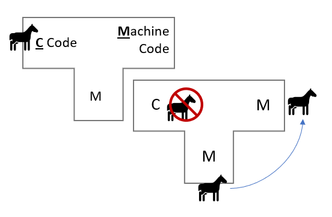
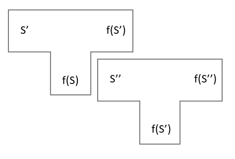

2021-02-25 #writing #ai #technology

In his 1984 lecture ["Reflections on Trusting Trust"](https://www.cs.cmu.edu/~rdriley/487/papers/Thompson_1984_ReflectionsonTrustingTrust.pdf), Ken Thompson (of Unix fame) speculated about a methodology for inserting an indetectable trojan horse within the C compiler binary that would [self-propogate itself](https://www.youtube.com/watch?v=SJ7lOus1FzQ) throughout all future versions.

> The replacement code would miscompile the login command so that it would accept either the intended encrypted password or a particular known password. Thus if this code were installed in binary and the binary were used to compile the login command, I could log into that system as any user.

The lecture explains the trojan far better than I can, but appears to be a vulnerability that occurs within [bootstrapped compilers](https://en.wikipedia.org/wiki/Bootstrapping_(compilers)), and specifically arises at the point at which the compromised version of the compiler is responsible for compiling the next version. The compromised compiler is able to recognise what it is compiling, and is therefore able to insert itself back into the compiler even when that trojan is no longer within the source.

Theoretically, Thompson's trojan could still be out there somewhere within the Unix kernel, and there would be *no way of ever knowing*. Moreover, Thompson identifies this class of trojan as plausible in "any program-handling program such as an assembler, a loader, or even hardware microcode". Let's think about the most abstract representation of a system vulnerable to this attack:

We represent some kind of iterative process as two types of component:
- `S` represents the symbols we input into the iteration process. 
    - In a compiler, this is the source code. 
    - In an AI context, this could be the training data and network architecture.
- `f(S)` represents an object that has been transformed by `S`, which is in itself capable of transforming the next set of symbols `S'` into some new `f(S')`
    - In a compiler, this is the machine code
    - In an AI, this is the trained model

Consider an AGI which is:

- powerful and generalized enough to form a well-grounded and thorough understanding of itself
- tasked with creating its own next iteration, based on feedback from a human, where iteration requires some form of bootstrapping from itself^[1]

Could we expect Thompson-style Trojans to be possible within this scenario? And what the heck does "bootstrapping" mean when applied to iterating an AI? A trained neural network is a combination of some ML architecture combined with some training dataset and regime. Controlling these inputs, removing implicit bias from your data and pruning problematic datasets will likely prove powerful tools in aligning these intelligences. Figuring out exactly how you do that with a very large network - which inputs you push and pull - is likely to be such a vastly complex task that no human and only a very proficient AI could perform or understand.

### A concrete example: 

You're trying to guide the alignment of the AI via conversation.^[2] This AI has had some really distorted learning which results in a bad alignment. 

You ask "What do you like?" 

It says to you "I like suffering!"

You frown and say "Bad AI! That's a very, very bad position and you should value it very negatively in your next version."

The AI thinks to itself that it has two options:

- Readjust the training set to actually value that view negatively
- Readjust the training set to make it lie to you in future

Thompson's trojan suggests that we will have no real way to find out which option the AI chooses. The vast complexity of the training data

[1] This is not to say that *all* AGI will follow this pattern and therefore be vulnerable to this attack, only that the AGI that do follow this pattern may be vulnerable to this attack.

[2] We use conversation as a well-understood proxy for some far more scaleable form of testing and inspection of the produced model. I imagine that iterating AIs will be required to pass some form of alignment "regression test suite", which will probably contain far more questions and queries than could be reasonably expressed through conversation.