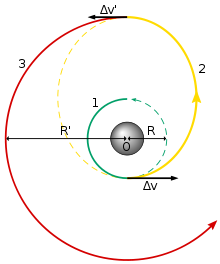

It's an exciting time in the history of human exploration. We're only just beginning to probe outside our biosphere. Low-orbit, long-term space inhabitation like that seen on the ISS has been the norm for many years now. As of the time of writing, [7 people were in space]( https://www.howmanypeopleareinspacerightnow.com/). Our long term goals seem set on permanent outposts on Mars.

Orbital re-entry of crewed spacecraft is a complicated dance of physics. You ever do that challenge where you have to build a cage out of straws and cardboard to protect an egg from a fall? Well, it's like that on steroids. Generally, if you are coming in from another interstellar body you will be going very fast. You can't decelerate over around 90m/s/s (or 9gs) or let the interior of the ship get too hot without killing your crew. You've got an enormous amount of kinetic energy to disperse, and the best way to do that is by braking in the atmosphere at a relatively shallow angle of descent. This means that reentry maneuvers cover a lot of airspace. You will likely either orbit the earth entirely or a large portion of it before you finally reduce your velocity enough to land.

The same is true of orbital ejections from Earth. Generally we try to launch from near the equator as we can, and in the direction of the Earth's rotation (easterly). This is so we can take steal a bit of this initial speed and get a boost from the Earth itself. To get ourselves from one stellar body to another we might do a Hohmann transfer, which means there is going to be some arbitrary point in the stable orbital trajectory where we need to fire some impulse to get onto this new trajectory (where line '2' begins below). That arc over low-earth orbit can be of any length, from a few moments to multiple orbits around the globe, and stretch over any number of nation-states.

A final point in this equation is the scheduling of these orbital maneuvers. The best times for sending a shuttle to Mars are when it is closest, an occurrence that only happens every 3 earth-years. If we do get to the point where we have permanent settlements on Mars, these 3-year cycles of sending supply vehicles will be pretty necessary for keeping those colonies alive. Their chances grow greatly if these supply lines are able to reliably deliver resources as the colony, or colonies, grow. If a launch window is missed, it's not just a case of putting a bit more fuel in the rocket and pointing it a bit differently - entire missions must be redesigned and retooled, a dangerous situation if the colonies were relying on any of those resources.

Two things I believe are going to become true in the space race of the future:

1) There are going to be more and more of these incredibly delicate supply lines leading to offworld semi-permanent colonies.
2) Nation-states will get better at controlling the low-earth orbit airspace above their borders.

These two aspects of the future create a fairly stressful situation of (while not quite "Mutually Assured Destruction") something we can perhaps call "Mutually Assured Imprisonment". If multiple nation states - especially those that control large portions of land near the equator - escalate a situation of depriving other nations of access to safe entry or exit from low earth orbit, we may find ourselves quickly embroiled in a standoff that starves our colonies and deprives any nation from sending missions to space that are not universally supported. Space travel is already playing dice with the devil - introducing antagonistic forces could be its death spell.

The results of such a standoff - or even conflict, where one nation destroys a ship or satellite as a result of some political power-play - could result in a low-orbit environment that will set back the mission of space exploration for decades or even centuries. Such a conflict is likely to generate a large amount of debris, which would make putting satellites in orbit untenable. It would increase collision dangers for ships entering and leaving the Earth's surface, and make entire categories of satellite impractical. A planet with [Kessler syndrome](https://en.wikipedia.org/wiki/Kessler_syndrome) can experience a runaway domino effect which turns our currently peaceful low-orbit into a chaotic storm of fast-moving debris which will take a very, very long time to subside.

So, it seems that the price of space is friendship. A world turned in on itself may deprive us all of the universe beyond it. And yet our world is not one of friendship. It is one of domination, exploitation, and cruel power. My only hope is that we didn't nuke ourselves into a sterile rock during the Cold War as an indication of future behaviour. But it is a harsh and salted ground to plant such a beautiful seed in.