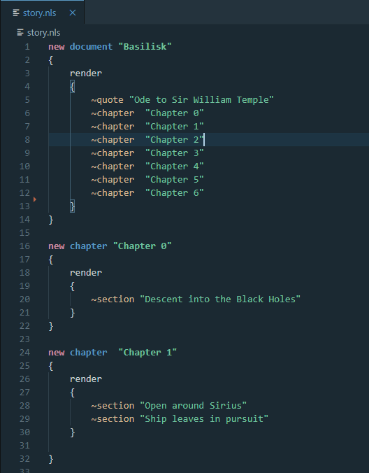

2020-08-17 #programming

*gnuciDictionary* is an offline nuget port of the [GNU Collaborative International Dictionary of English](https://gcide.gnu.org.ua/) for .Net. Defining a word is simple: Simply give a string, and you will be given a list of definitions for that string, or null if no definition can be found.

```
IEnumerable<gnuciDictionary.Word> definitions = gnuciDictionary.EnglishDictionary.Dictionary.Define("cat");
Console.WriteLine(definitions.First());
```

This will return an enumerable of Words, which contain information like what kind of word it is, what the definition is, and what the plural is.

```
cat: Any animal belonging to the natural family Felidae, and in particular to the various species of the genera Felis, Panthera, and Lynx.
```



### Under The Hood

Word definitions are stored as compressed JSON files (“/data/gzip”). Each file is called something like dict_al.dat – the al here indicating that this file contains all words starting with those two letters. This allows gnuciDictionary to have a almost zero memory footprint as well as low disk storage footprint (~5MB).

### [Github](https://github.com/cowtrix/gnuciDictionary)

### [Nuget](https://www.nuget.org/packages/gnuciDictionary)
